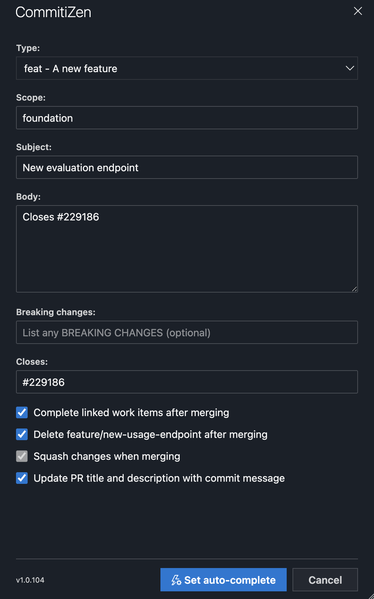
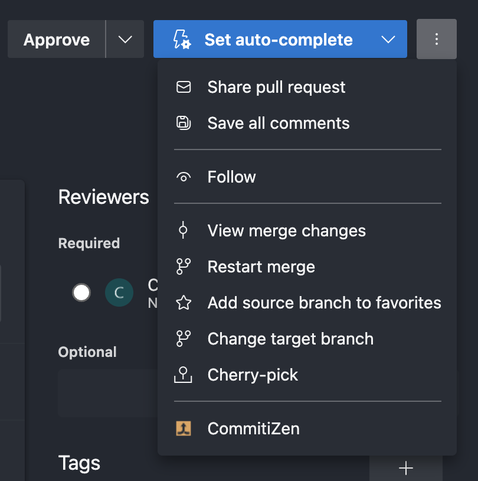

# Azure DevOps Extensions

A collection of [Azure DevOps extensions](https://docs.microsoft.com/en-us/azure/devops/extend/?view=azure-devops).

## [CommitiZen Pull Request](pull-request-cz)

Adds a [commitizen](https://github.com/commitizen)-style dialog to the pull request action menu, so you can complete or set auto-complete on a PR with a properly formatted [conventional commit](https://www.conventionalcommits.org/) merge message.



Open it from the pull request's `...` action menu:



### What it does

Pick a commit type (`feat`, `fix`, `docs`, `chore`, `refactor`, ...), then fill in a scope, subject, body, breaking changes and closed issues. On submit it builds the merge commit title/description from those fields and sets or triggers auto-complete on the PR, carrying over the existing squash / delete-source-branch / complete-linked-work-items / update-PR-description options.

### Get it

Install [CommitiZen Pull Request](https://marketplace.visualstudio.com/items?itemName=aguafrommars.cz-pull-request) from the Visual Studio Marketplace.

### Project layout

- [main.html](pull-request-cz/main.html) / [scripts/main.js](pull-request-cz/scripts/main.js) — registers the action menu entry and opens the dialog.
- [contextForm.html](pull-request-cz/contextForm.html) / [scripts/context.js](pull-request-cz/scripts/context.js) — the dialog itself: form markup, styling and the commit-message logic.
- [vss-extension.json](pull-request-cz/vss-extension.json) — the extension manifest (contributions, scopes, packaged files).

### Building the extension

```sh
cd pull-request-cz
npm install
npx tfx-cli extension create --root . --manifest-globs vss-extension.json --output-path dist \
  --override '{"publisher":"<your-publisher-id>","id":"<your-extension-id>","name":"<name>","public":false,"version":"<x.y.z>"}'
```

Bump `version` on every rebuild — Azure DevOps caches an extension's assets by version, so re-uploading the same version won't pick up changes.

### Installing a private build

1. Upload the generated `.vsix` under your own publisher on the [Visual Studio Marketplace](https://marketplace.visualstudio.com/manage).
2. Share it with your Azure DevOps organization from the publisher's management page.
3. Install it from `https://marketplace.visualstudio.com/manage/publishers/<your-publisher-id>` or via the organization's extension management page.

A different `publisher`/`id` installs side by side with the public extension without conflict; the action menu will show both entries until one is uninstalled.

### Release build

CI packaging is handled by [pull-request-cz/make.cmd](pull-request-cz/make.cmd) (Windows-only) and [appveyor.yml](appveyor.yml).
