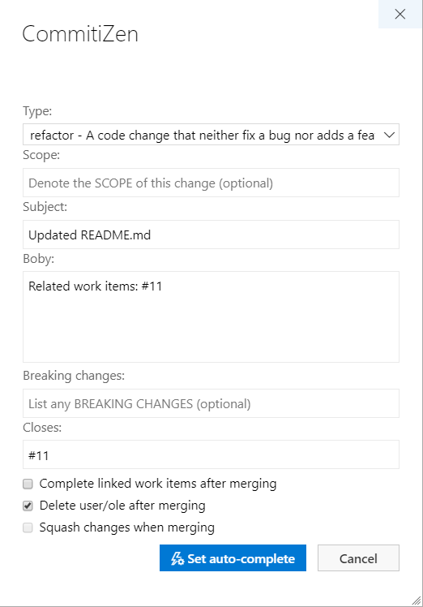

# COMMITIZEN PULL REQUEST

Add [commitizen](https://github.com/commitizen) in Pull Request action menu to format PR merge commit message.

  

Opening a dialog box where you can complete or set auto-complete the pull request with a formated commit message.  

